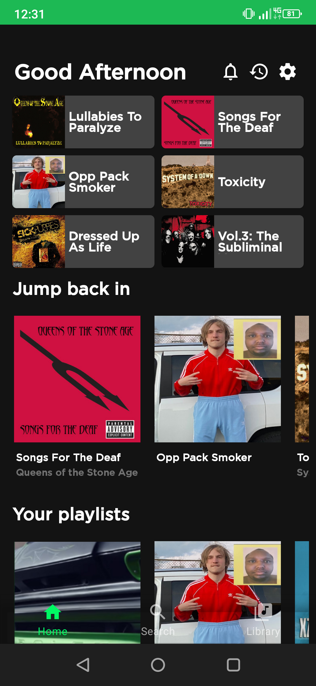
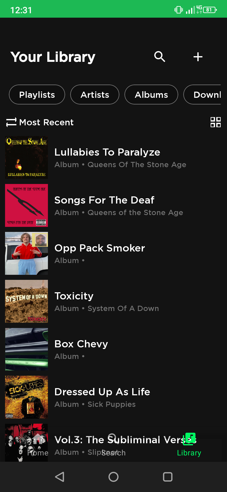
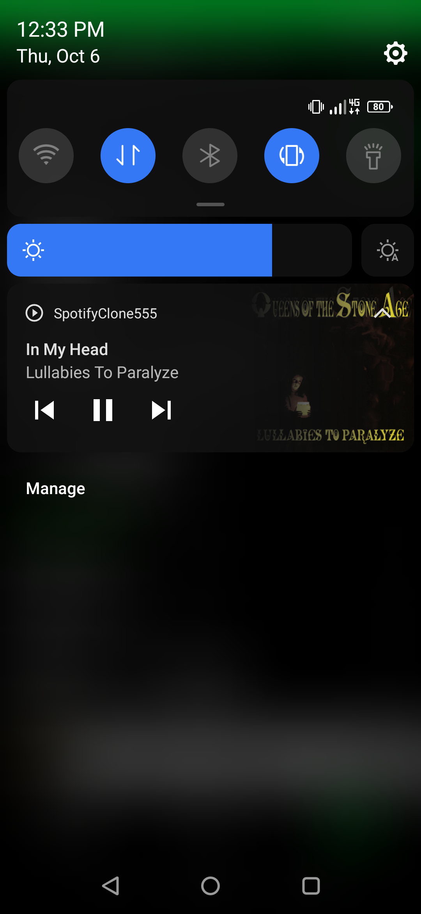
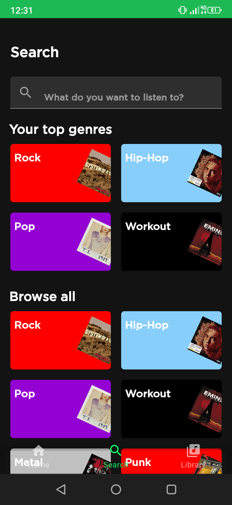
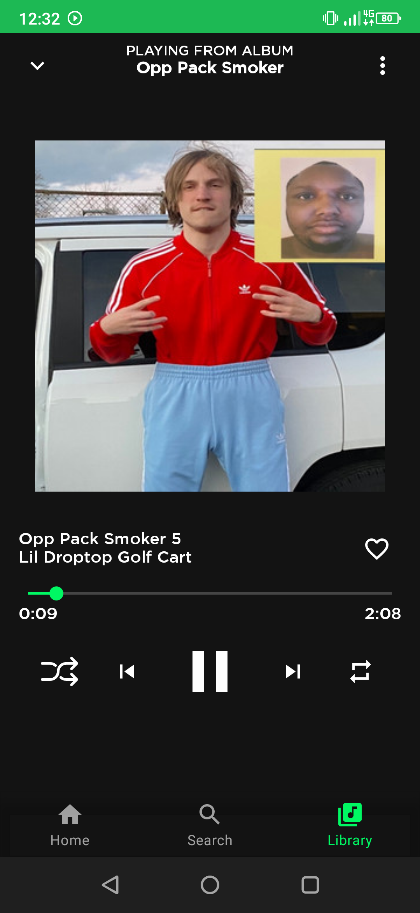

# **Spotify Clone**

A Spotify Clone App that can play music, and has a good looking UI that is very similar to actual Spotify Mobile App on Play Store

I used technologies and patterns such as

- MVVM architecture
- Services
- Notification Player
- Exoplayer
- LiveData
- Glide
- Kotlin Coroutines
- Navigation Components
- RecyclerView inside of a RecyclerView
- Fragments
- Material Components
- Data Binding
- View Binding

## Assets

The part I struggled with was the Notification Player part. Other Spotify Clone Apps out there don't have a Notification Player feature, but I wanted to implement it in order to gain extra functionality.

## How we supposed to test the application?

You can run the application by simply opening it with Android Studio. I will also provide an APK file in apk directory, if there is no apk directory, then I probably didn't provided it yet so stay tuned

***This project is not a part of some courses I've taken or some bootcamp. I did not followed any project implementation out there... So the project is totally unique.***