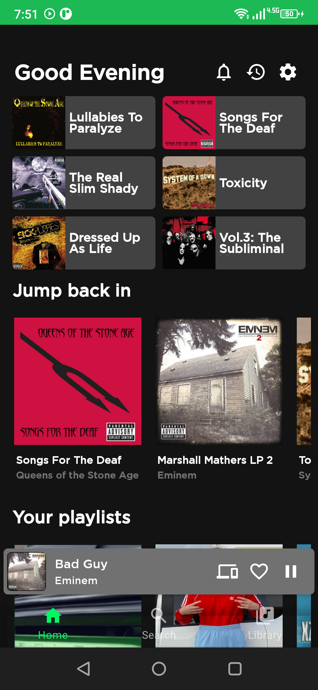
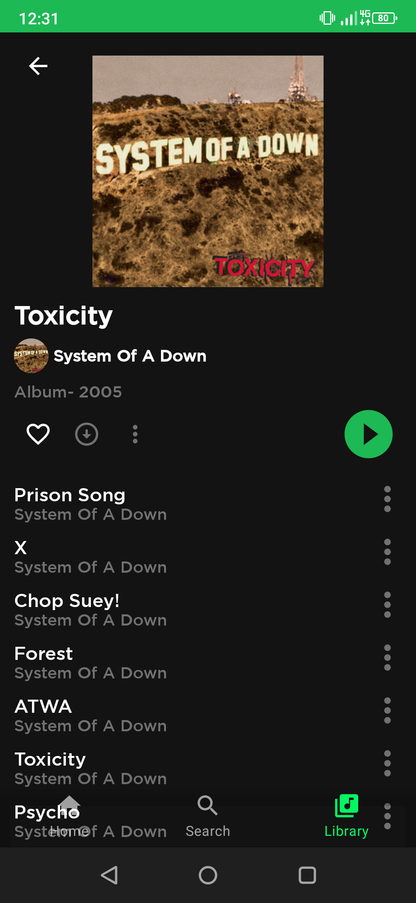

# **Spotify Clone**

A Spotify Clone App that can play music, and has a good looking UI that is very similar to actual Spotify Mobile App on Play Store

I used technologies and patterns such as

- MVVM architecture
- Services
- Notification Player
- Exoplayer
- LiveData
- Glide
- Kotlin Coroutines
- Navigation Components
- RecyclerView inside of a RecyclerView
- Fragments

## Assets

[]
[]
[]
[]
[]
[]

The part I struggled with was the Notification Player part. I know other Spotify Clone Apps out there don't have a Notification Player feature, so I focused on that. Also it actually can play music. 

You can run the application by simply opening it with Android Studio. I will also provide an APK file in apk directory, if there is no apk directory, then I probably didn't provided it yet so stay tuned

This project is not a part of some course I've taken or some bootcamp I was in so it's totally unique.